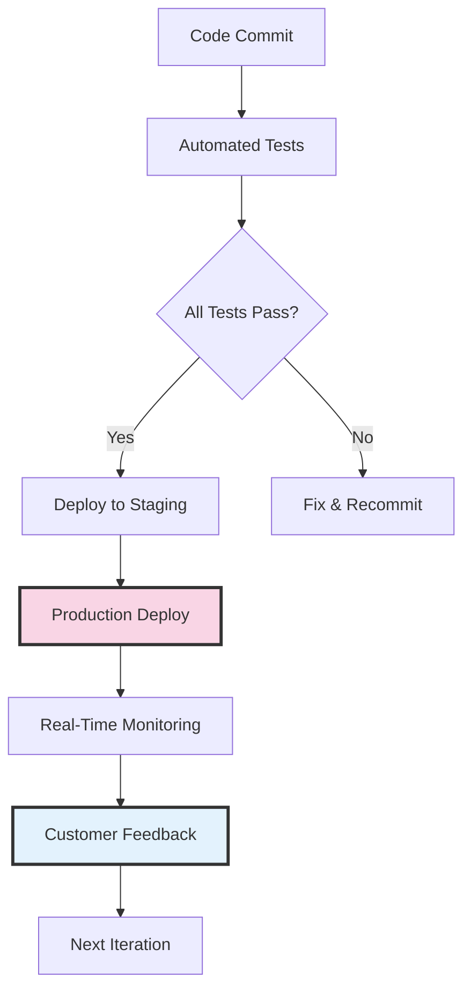

# From Zero to a Thousand Clients: Why I Deploy to Production Every Day

There's a moment every developer knows. You've written the code, tested it locally, maybe even shown it to your team. But it's not real yet. Not until it hits production. Not until actual users are touching it, breaking it, loving it, cursing at it. That's when code becomes software.

I learned this lesson deeply over eight years at Wisc.ai, where I took a platform from zero to a thousand clients. And let me tell you—there's no margin for error when you're handling production systems at scale.

## The Architecture of Always-On

When you're building systems that serve thousands of clients, your architecture needs to breathe reliability. Here's what that looked like in practice:

## The Post-Login Reality

Here's something most people don't get: the real work starts after the login screen. That's where the complexity lives. Authentication is just the door—what matters is what happens inside.

For years, I worked exclusively on these post-authentication features. The dashboards, the data processing, the real-time updates. These aren't demo features. They're production workhorses that need to perform flawlessly 24/7.

## Shipping at the Speed of Thought

What used to take weeks now takes hours. Sometimes minutes.

I just shipped a feature yesterday afternoon. By evening, I was watching customers use it in real-time through our analytics. One user found a edge case I hadn't considered. Fixed it. Deployed again. All before dinner.

This isn't recklessness—it's confidence built on modern tooling. Claude Code, Cursor, Sonnet 3.7 and 4, now Opus. These aren't just tools; they're accelerators that compress the feedback loop from idea to impact.

## The Production Paradox

Here's what I've discovered: the more you deploy, the safer it becomes. 

When I started at Wisc.ai, we did quarterly releases. Big, scary, all-hands-on-deck deployments. Everyone held their breath. By year eight? We were pushing multiple times daily. Smaller changes, faster feedback, happier customers.

The constraints of production—everything must work, always—actually make you a better developer. There's no "it works on my machine" when a thousand clients depend on your code.

## From Imagination to Implementation

The game has fundamentally changed. I can imagine a feature in the morning and watch customers use it by lunch. Not a prototype. Not a demo. Real, production-ready code serving real users.

Last week, a client mentioned they needed better data visualization. I sketched out the concept, explained it to my AI tools, and within two hours had a fully functional analytics dashboard deployed to production. The client's response? "How did you build this so fast?"

That's the wrong question. The right question is: "Why would we build it any slower?"

## The Maintainability Myth

"But what about technical debt?" I hear this constantly. Here's the truth: shipping fast doesn't mean shipping garbage. The same AI tools that accelerate development also enforce better patterns, catch more bugs, and suggest cleaner architectures.

My code from eight years ago at Wisc.ai? Still running. Still scaling. Still maintainable. Because production teaches you discipline that no amount of planning can replace.

## The New Reality

We're living through a fundamental shift in software development. The bottleneck isn't technical capability anymore—it's imagination. The moment between "what if we could..." and "here it is in production" has collapsed.

I don't just love shipping to production. I live for it. That moment when code becomes reality, when ideas transform into tools that actual humans use to solve actual problems. And now? I can experience that rush multiple times every single day.

The future isn't about careful planning and quarterly releases. It's about continuous evolution, instant feedback, and the courage to ship. Welcome to the age where production is the new development environment. And honestly? There's nowhere else I'd rather be.