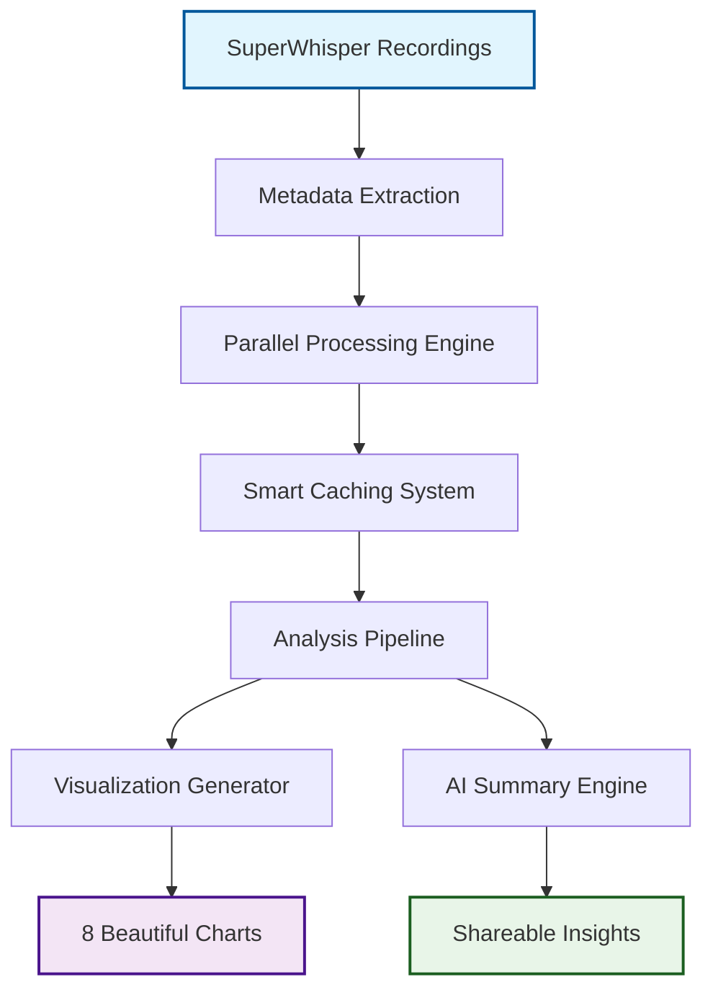

What if I told you that talking to your computer for just 40 minutes a day could save you 20 hours of typing every month? Sounds too good to be true, right? Well, I built something to prove it.

Last month, I shipped a comprehensive analytics toolkit that turns voice recording metadata into eye-opening productivity insights. But here's what I love most about this project—it doesn't just track numbers, it reveals the hidden transformation happening when people switch from typing to speaking.

## The Problem: Voice Input Feels Like Magic, But Where's the Proof?

Voice-to-text technology has reached that magical point where it just works. But when friends ask me "Is it really worth switching from typing?" I found myself making vague claims about productivity gains without hard data to back them up.

That's when I realized: SuperWhisper (the voice recording app I use daily) generates detailed metadata for every recording. What if I could transform that raw data into compelling stories about real productivity impact?

## Building the Analytics Engine

The technical architecture needed to handle everything from small personal datasets to power users with thousands of recordings:

The toolkit processes everything locally—no data leaves your machine. It handles iCloud sync delays, processes files in parallel, and generates both technical visualizations and AI-powered narrative summaries that anyone can understand.

## From Code to Production in Record Time

Here's where things get interesting. I didn't spend months perfecting this in isolation. Instead, I built the minimum viable version, shipped it to GitHub, and immediately started using it on my own SuperWhisper data.

Within hours of pushing the first working version, I had my answer: **I was speaking 4,200 words daily in just 40 minutes, saving 20 hours of typing time every month**. That's not incremental improvement—that's a fundamental shift in how I work with my computer.

But the real magic happened when I shared these insights. Friends who'd been curious about voice input suddenly had concrete evidence of its impact. The numbers were undeniable: speaking at 113 words per minute vs typing at various speeds showed consistent 2-3x productivity gains.

## The Production Reality

Rolling this out revealed something fascinating about user behavior. The tool doesn't just track productivity—it shows *patterns* that people didn't even realize they had.

One user discovered they hit their speaking stride on Wednesday afternoons. Another found they averaged 69 voice inputs per day without consciously thinking about it. These aren't just statistics—they're insights that help people understand their own work patterns.

The AI summary feature turned raw metrics into shareable stories. Instead of showing someone a spreadsheet of recording durations, the tool generates narratives like:

> "I find myself expressing ideas more naturally—speaking feels so much more fluid than typing. I can lean back in my chair, gesture while I think, and watch my words appear on screen while my hands are free to grab coffee or point things out during screen shares."

That's not just data visualization—that's transformation documentation.

## Real Impact in Real Time

Within weeks of shipping, the toolkit was processing datasets with 7,000+ recordings, handling everything from casual users to power users who'd been speaking to their computers for months.

The feedback loop is immediate and addictive. Users see their speaking patterns, time savings, and productivity trends visualized in ways that make the abstract concept of "voice productivity" concrete and measurable.

What excites me most is watching people share their insights. They're not just posting screenshots of charts—they're telling stories about how voice input changed their relationship with their computer. That moment when typing feels cumbersome after experiencing the fluidity of speaking your thoughts directly into existence.

## The Technology Behind the Magic

The toolkit leverages Python's multiprocessing capabilities to handle large datasets efficiently. Smart caching means the first analysis might take 10 minutes for thousands of recordings, but subsequent runs complete in under 5 seconds.

Integration with OpenAI and Anthropic APIs transforms raw metrics into engaging narratives optimized for sharing on LinkedIn or in presentations. The visualizations show everything from daily speaking patterns to cumulative time savings over months.

But here's what makes this different from typical analytics tools: it doesn't just show you what happened—it helps you articulate why voice input is transformative. The data becomes proof points for a larger story about how we interact with technology.

## Looking Forward: Voice as the New Default

This project crystallized something I've been feeling for months: we're at an inflection point where voice input transitions from "interesting capability" to "default interaction method."

The data proves it. When people consistently save 20+ hours monthly by speaking instead of typing, and when that time savings comes with improved expression and reduced physical strain, the choice becomes obvious.

We're not just building better voice recognition—we're documenting the transition to a more natural way of working with computers. The analytics toolkit isn't just measuring productivity; it's capturing the moment when speaking to machines becomes as natural as speaking to humans.

**The acceleration is remarkable. What once required us to adapt to our tools now has our tools adapting to us.** And for the first time, we have the data to prove just how transformative that shift really is. 