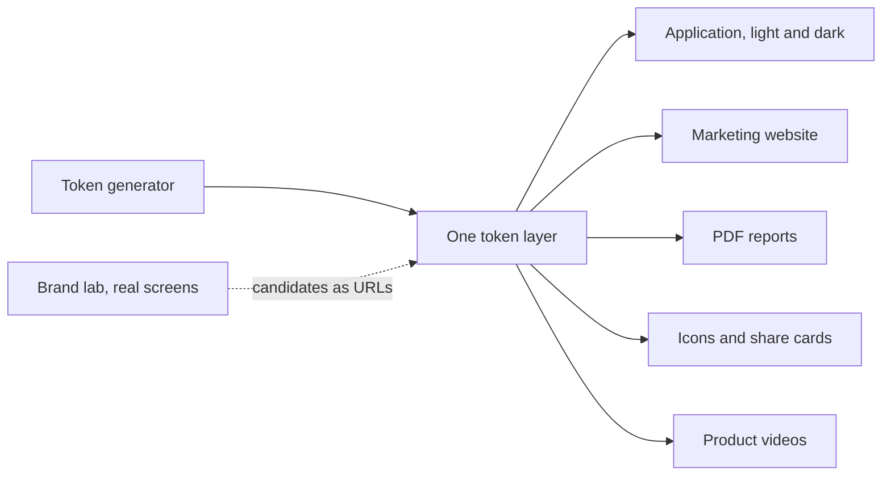

This weekend [TourCockpit](https://tourcockpit.com), my booking platform for tour companies,
changed its brand. Not a button.
Not a landing page refresh. The whole thing: the application, light and dark mode, the marketing
website, the sign-in screen, the favicon, the social share cards, the printed PDF reports, and all
38 product videos in two languages. One decision, one push.

The interesting part is not that it happened quickly. The interesting part is why it could.

## Style is data

Every screen in the product reads its colours, type, and spacing from one place: a token layer. No
component knows what colour it is. A button knows it is "the primary action", a table header knows
it is "a quiet surface", and one file decides what those things look like today. The tokens
themselves come out of [a generator I built](https://styleguide.ideaplaces.com), one of the
IdeaPlaces products, so the brand has a source of truth that lives outside anyone's head.

That sounds like discipline for its own sake, right up until the day you want to change your mind.
Then it is the difference between a rebrand being a quarter-long project with a committee, and a
rebrand being a deploy.

## The lab: candidates you can live in

I want TourCockpit recognised on sight across its industry, the way a certain orange means
Strava. You do not pick that colour from swatches. Swatches lie. A colour that looks confident on a
palette card can flood a dense data screen and drown the information the screen exists to show.

So instead of mockups, I put a brand lab inside the product itself.
[It is live](https://tourcockpit.com/brand-lab), you can go play with it. A public page renders the real
screens with fixture data, and a panel switches the candidate palette, the heading face, the body
face, light or dark. Because every component already reads tokens, a candidate is just a different
set of values. The real product wears the costume. Nothing is redrawn.

Two details did most of the work:

**The contrast maths sat next to the taste.** Every candidate carries a live accessibility score,
computed the way the system actually paints: the label on the real button, the accent as text on
the real background. Half the candidates eliminated themselves. Taste picked from what was left.

**The URL is the state.** Every switch writes itself into the address bar, so anyone can click through
through the candidates and send back exactly what they saw as a link. No screenshots, no "the third
one, no, the other third one". Feedback becomes a URL.

## The feedback that mattered

I sent the link around. The most useful answer was one line from a friend: the candidates all
looked the same to her. Dark, tech. Nothing said travel, and this is a product for people who sell
holidays.

She was right, and the reason was instructive: I had briefed the generator so carefully against
clichés that it produced twelve tasteful variations of the same idea. So I ran a round in the
other direction: sun-warmed paper instead of grey-white, humanist rounded type instead of cold
grotesks, accents from the warm side of the wheel. Then I refined the best of those by hand, with
the contrast maths keeping me honest, and merged the two strongest ideas into one: a burnt gold
signature over a deep sea-dark ink, on paper the colour of late afternoon. Dark mode is not a
server room; it is the same palette after sunset.

The whole argument, from "they all look the same" to a decided brand, happened in links.

## One shot

The winner went back into the generator, so the source of truth survived the excitement. Then the
export replaced the token layer, and everything that reads it followed: every screen, both modes,
the marketing site, the sign-in page, the icons, the PDFs.

The part that surprises people is the videos. The product's help videos and demos are generated,
not recorded: a headless browser drives the real product and captures the screens, and the film
cuts itself around the narration's own word timings. Which means the videos read the token layer
too, one step removed. After the push, the pipeline re-captured and re-rendered all 38 clips in
both languages, unattended, in 73 minutes. The narration did not change, so it cost nothing to
re-voice. The screens changed, so the films followed them.

While the re-render ran, I found the one place a colour had been hard-coded instead of read from a
token: the highlight in the video captions. One line. That was the entire migration debt of the
rebrand, and it is the exception that states the rule.

## The bigger point

Most companies treat brand as paint. Paint soaks in. Two years later the old blue lives in a
thousand files, three PDF templates, an email footer, and a video nobody can re-shoot because the
person who recorded it left. So the rebrand becomes a project, the project becomes a committee, and
the committee decides the current brand is fine.

Treat style as data and the calculation flips. Deciding what the company looks like stays exactly
as hard as it should be, a real argument about identity, taken with real feedback. Executing the
decision becomes free. And when execution is free, you can afford to change your mind, which means
the look of the product can keep up with your understanding of who it is for.

The rebrand was one shot. The years of never hard-coding a colour were the trigger being
loaded.

*TourCockpit and the style guide generator are part of [IdeaPlaces](https://ideaplaces.com), the
product portfolio I build with my son Luca.*
