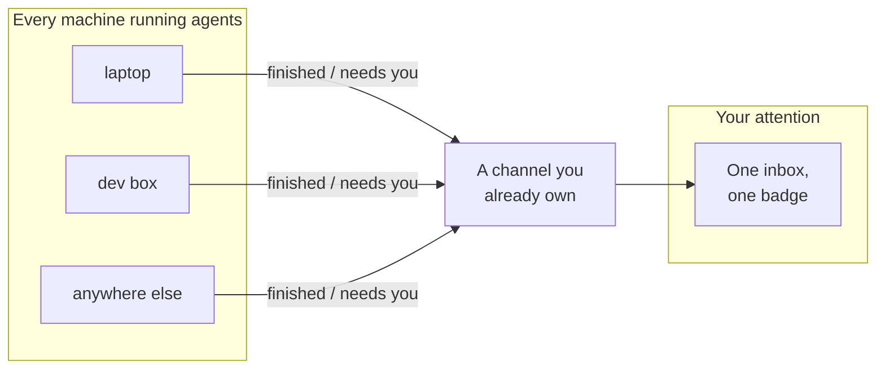

Running one AI coding session needs no tooling. You start it, you watch it, it finishes, you read the result. The loop closes by itself because you never left.

Running a dozen at once, some on a laptop and some on a dev box across the city, is a different job entirely. I noticed something uncomfortable a few weeks ago: the agents were fast and I was slow. Not slow at reviewing, slow at *finding out*. Work would sit finished for forty minutes because my attention was three terminals away. And the worse case, the one that actually costs money: a session blocked on a permission prompt, doing nothing, looking exactly like a session that is thinking hard.

That second one deserves a moment. An agent waiting for you to approve a command is indistinguishable, from the outside, from an agent working. Same spinner, same silence, same terminal. So the only way to know is to go and look. Which means the more agents you run, the more of your day becomes walking a beat.

I have written before about [getting out of the AI's way](/blog/you-are-the-bottleneck). This is the sequel, and the constraint moved. It is no longer that I interfere too much. It is that I cannot see enough.

## The compute was never the constraint

Here is the reframe that made the solution obvious.

I kept thinking about this as an observability problem. Dashboards, status pages, a list of running sessions. Build a place to go and look, and looking gets cheaper.

That is the wrong shape. A dashboard is still polling, just with better ergonomics. It still requires me to decide, repeatedly and with no information, that *now* is a good moment to check. I will be wrong most times I check, and the times I am right I could have been told.

Attention is not a display problem. It is a queue problem. I have exactly one attention, it processes one thing at a time, and a dozen agents are producing events for it with no scheduler in between. Nothing in my stack owned that queue, so the queue was me, holding it in my head, badly.

Once you see it as a queue, the fix stops being a dashboard and becomes an inbox. Sessions interrupt me. I stop going to look.

## Inverting the polling

Three parts, and the interesting decision is the middle one.

Each machine reports two events and only two: a turn finished, or an agent is waiting on a human. Both are moments where the queue changes state. Everything else an agent does is its own business.

The middle box is deliberately not mine. It is a channel that already exists, either a lightweight public pub/sub topic or a private chat channel. I built no server, and that is a design decision rather than a shortcut. A server would need hosting, uptime, an account system, and a privacy policy, and would deliver exactly what the existing channel already delivers: durable messages, push to a phone, and a place that is already private. Building a third one would be effort spent moving sideways.

The last part is a small native app that turns the channel into one badge in the corner of the screen. Two agents waiting, three finished. That is the entire interface, and it is enough, because the point is not to give me a new place to look. The point is that I stop looking.

## The decisions that were not obvious

Building an inbox is easy. Building one that does not become noise took three choices I did not expect.

**Items expire on the time I actually spend at the keyboard, not on the clock.**

This sounds like a detail and is the whole thing. If items age out on wall-clock time, then stepping away for coffee silently drains the queue, and I come back to a tidy badge and three agents that gave up waiting. The clock has to stop when I do. While I work, the list ages out so it stays short and stays honest. While I am gone, it waits. The backlog I return to is exactly the backlog I missed.

Any notification system that does not model your absence is quietly lying to you about what happened while you were gone.

**Short turns never enter the queue.**

A quick conversational exchange with an agent takes ten seconds and is not an event. Report those and you get a notification per sentence, and within a day you have trained yourself to ignore the badge. A queue that surfaces everything is the same as no queue, except now you also distrust it. So anything under a threshold never arrives at all.

The general rule: the value of an alerting system is set by what it refuses to tell you.

**Clicking an item does nothing except acknowledge it.**

The first version opened the project folder in an editor, because obviously you would want to jump to the session. Except it could not actually reach the session. The notification carries a fragment of the session identifier, and resuming needs the whole thing, so a click opened a correct-looking blank window in the right folder. That is worse than doing nothing, because it looks like it worked.

I removed it. A feature that is right 0% of the time and looks right 100% of the time is a liability, and shipping the honest version of a small thing beats shipping the impressive version of a broken one.

## What this actually changed

I stopped walking the beat. Sessions that need a decision reach me in seconds instead of whenever I next wandered past, and finished work gets reviewed while the context is still in my head rather than an hour later when I have to rebuild it.

The number that surprised me was not throughput. It was how much of my day had been spent on the *checking*, an activity that produces nothing and that I had never counted because it never appeared as a task anywhere.

I put the whole thing out as [an open source project](https://github.com/Ideaplaces/agent-inbox), MIT, one command to install. It is beta and I will say so plainly: it does the job on the machines I run it on, it has had few users, and the last few changes reversed earlier decisions rather than extending them. That is what beta means and it is fine.

## The part that generalises

Every layer of software we build eventually grows an interface to human attention, and we usually bolt it on late and badly. Logs got alerting. Deployments got notifications. Code review got a request queue. Each of those started as "just go and look" and stopped scaling at almost exactly the moment the thing being watched got cheap enough to run in parallel.

Autonomous agents are hitting that moment now, and faster than anything before them, because the marginal cost of one more agent is almost nothing while the marginal cost of one more thing to keep track of is entirely paid by you.

So the question worth asking about any system you are building is not how many agents it can run. Everyone's answer to that is trending toward "as many as you like." The question is what it does to your attention when it runs a hundred of them. If the answer is "shows you a list," you have not solved it. You have moved the walking indoors.

Build the scheduler for your own attention. Nobody else is going to own that queue.
