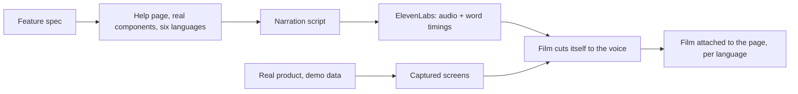

Documentation has a dirty secret: it is a photograph of the product on the day someone wrote it.
The product moves, the photograph does not, and six months later your help center is confidently
explaining a screen that no longer exists.

I refused to accept that for [TourCockpit](https://tourcockpit.com), so its help center works on a
different principle. A help page is not written about the product. It is built out of the product.
And the film at the top of each page is not recorded by a person. It films itself.

## The page is the product

Start with what a help topic is made of. The words come from the feature's spec, the same document
the feature was built from, so the explanation and the implementation share one source of truth.
The screenshots are not screenshots at all: every demo on a help page is the real product
component, rendered live with sample data. A hand-copied picture drifts the day the screen
changes. The real component cannot drift, because it is the same code the app runs.

Every sentence on every page exists in six languages, and this is enforced, not encouraged: the
content is typed so that a missing translation fails the build. There is no way to ship a
half-translated help center. The translations themselves go through a translator agent that knows
the product's own vocabulary, so the Spanish page says *excursión* and *plazas* exactly where the
Spanish product does.

## The film is a function of the page

Here is the part I like most. Each topic carries a short narrated film, and the film is generated
end to end. The script is written from the page. ElevenLabs turns it into narration, and, crucially,
returns the timing of every spoken word along with the audio. Markers in the script resolve against
those timings, so the narration becomes the master clock of the film: every cut, every camera move,
every caption is computed from when the words are actually said.

The pictures come from the product itself. A headless browser drives the real application with
seeded demo data, captures the screens the script talks about, and the renderer cuts them to the
voice. Nobody points a camera at anything. Nobody edits a timeline. Change the script and the film
re-cuts itself; change the product and the film re-captures itself.

Languages multiply for almost nothing. The films exist in English and Spanish today: same script,
translated through the same agent, re-voiced, and the entire film re-times itself around the new
narration, because the cuts follow the words. That is why the English cut of one topic runs 1:10
and the Spanish 1:07: Spanish says it three seconds faster, and the picture simply follows. The
other four languages read their own prose and play the English film until their voice is a
translation away.

## Why this matters beyond the help button

When the product rebranded last weekend, all 38 help films re-made themselves in the new brand,
unattended, because a film here is a function of the product and the narration, not a recording.
That was the moment this stopped feeling like documentation tooling and started feeling like
something else.

Because think about what the pipeline actually is: specs in, and out come explained pages built
from real software, with a narrated, localized film per page, that stay current forever. Every SaaS
company on earth has the same rot in their help center and the same dread of re-recording videos.
This could be a product in itself. For now it ships inside TourCockpit, where a dispatcher in
Spanish or a reseller in English presses play and watches their own product explain itself, in
their own language, exactly as it looks today.

The photograph problem dissolves once you stop taking photographs. Build the help out of the
product, clock the film to the voice, and the documentation cannot lie about the software, because
it is the software.

*TourCockpit is part of [IdeaPlaces](https://ideaplaces.com), the product portfolio I build with my
son Luca. The help center is live at [tourcockpit.com/help](https://tourcockpit.com/help), films
included.*
