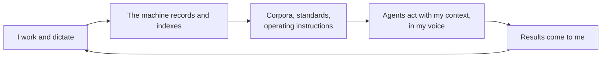

DHH just shipped Omarchy 4, his own Linux distribution. He calls it "the malleable OS for the age of agents." He spent 3,000 hours on it, left macOS after two decades, and there is now a foundation with $12.6 million behind the idea. The pitch is that your computer should be a true extension of who you are and how you work, and that in the age of agents, the machine has to be something an agent can read, script, and reshape.

I read that and recognized my own machine. Not the laptop. The laptop is a screen with a keyboard. I mean the cloud VM I have been [developing on for over a year](/cloud-dev-machine-no-laptop-required), the one that started as infrastructure and has quietly turned into something else.

Here is what lives on that machine today. Forty-nine project folders, and they are not just work: the product portfolio of [IdeaPlaces](https://ideaplaces.com), my company, next to my accounting, my personal projects, every corner of my life as code in one place. Eleven CI runners building everything from iOS apps to documentation sites. Thirty-six agent triggers, seventeen of them on cron, running through [C3](https://c3.ideaplaces.com), one of our own products, investigating production errors, writing briefs, watching costs, posting to Discord while I sleep. A ledger with 596 agent sessions in it, every token on record. And the part that changes the category of the thing: 39,000 of my own dictations, indexed and searchable, next to every meeting I have recorded and my entire message history. When an agent on that machine drafts something for me, it retrieves how I actually phrase things before it writes a word.

That last paragraph is the post. The rest is why it matters.

## What DHH is actually solving

Strip away the Arch Linux and the tiling window manager and Omarchy is attacking three problems.

The first is ownership. After twenty years, DHH felt the platform closing around him, a workflow shaped by the vendor's priorities instead of his own. He wanted a machine he could rewire down to the keybinding.

The second is the cost of that ownership. Linux always offered total control, and the price was weeks of assembling a hundred pieces by hand. Omarchy is convention over configuration applied to the desktop: one command, strong opinions, productive in a minute, every opinion still editable afterward. It is Rails for the operating system, from the same author.

The third is the deep one. A GUI-first OS is opaque to an agent. A text-configured, keyboard-driven, everything-from-the-CLI OS is an environment an agent can operate. DHH's bet is that when agents do the mundane work, the winning computer is the one that is legible to them.

I agree with all three. I just think he stopped one layer too early.

## The personal computer is not the one on your desk

My development machine is spun up in the cloud and I SSH into it. That has been my setup for over a year, and I wrote about the mechanics already: the two disks, the daily snapshots, the environment you can rebuild from a script. The laptop contributes nothing but a window.

The consequence took longer to see than the setup took to build. When the machine is detached from the desk, it stops inheriting the desk's limits. It does not sleep when a lid closes. It does not care which laptop I picked up, or whether I am on hotel Wi-Fi, or whether I am present at all. [The agents finished, and nobody needed to notice](/the-agents-finished-nobody-noticed), because the results come to me instead of me going to look.

Omarchy makes agents one keystroke away on the machine in front of you. My version removes the machine in front of you from the loop entirely. The agent runs on my development machine as if I was running it myself, with all the context, whether or not I am there.

## From infrastructure to extension

The shift I did not plan is what accumulated on that machine.

It holds my engineering standard, one file that every project and every agent session inherits. It holds the operating instructions for every repo, written down every time a session learns something, so the next session starts smarter. It holds my glossary, the one that knows my dictation software writes "idea piece of" when I say IdeaPlaces. It holds my voice corpus, so anything drafted under my name is checked against how I actually talk. It holds my meetings, my messages, my decisions, my mistakes with their postmortems attached.

Every loop through that cycle makes the next loop better. A lesson learned in one session becomes a rule every future session follows. A phrase I use often becomes retrievable cadence. A production incident becomes a precheck that costs zero tokens on quiet days. The machine compounds, the way a codebase compounds, because that is what it is: the business, and increasingly the way I think about the business, replaced with code.

This is the point where "dev machine" stops being the right name. A dev machine is a place where work happens. This is a project in its own right, maybe the one with the highest return of anything I run, and what it is converging toward is me. It knows what I am building, how I decide, how I phrase things, what I got wrong last month. My son Luca works the same way on his own machine, and the shared standard means our two machines agree on how we build. Two people, a dozen products, and the reason that math works is sitting in a data center in Canada.

## Personal means it knows you

DHH is right that this is the age of agents, and right that the computer has to become malleable to meet it. Where I land differently is on what "personal computer" means now.

For forty years, personal meant the box was yours. Your desk, your files, your keybindings. Omarchy is the best version of that definition I have seen, and if I were choosing a desktop today, I would take it seriously.

But agents changed the definition. The computer that matters is no longer the one you touch. It is the one that knows you: your projects, your standards, your voice, your history, and can act on all of it without you in the room. That computer wants to run always, live nowhere in particular, and be reachable from anything with a screen.

The malleable OS for the age of agents might not be an OS at all. Mine is a machine that never sleeps, learns me a little more every week, and answers in my own voice. The laptop is just where I watch it happen.
