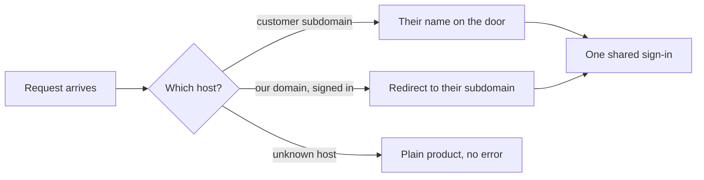

My first customer does not care about my product's name. Why would they? Their resellers know *their* name. So when the ask came in, it was the most reasonable ask in the world: when a tour operator opens [TourCockpit](https://tourcockpit.com), it should say the customer's name, on the customer's own subdomain, with the product reduced to a quiet "powered by" underneath.

In the old world this is a quarter of infrastructure work. Wildcard DNS, certificates, session cookies that survive crossing subdomains, login flows that land people on the right host, a middleware that keeps signed-in users off the naked domain. Every layer touches a different specialist.

I shipped it in one conversation with the agent. Not "prototyped": shipped, verified against production, documented, and covered by tests. Around 900,000 tokens of dialogue, six pull requests, four production deploys, one evening.

Here is the door it built, live in production, on the demo company's own subdomain:

## The design decision that made it cheap

The temptation with white-labeling is to build a registry: a table of hostnames, an admin screen, a provisioning workflow. I built none of that.

The hostname *is* the data. Every company on the platform already has a slug, and the resolver derives the brand from the host at request time: `customer.ourdomain.com` means the company whose slug is `customer`, an unknown host means no brand at all, and it degrades to the plain product rather than erroring. Nothing keeps a list of hostnames anywhere.

That one decision compounds. Company one thousand costs exactly what company three cost: a row in the database. When I later flip DNS from per-name records to a single wildcard, only infrastructure changes; the application never knew the difference.

The session follows the same philosophy. One cookie, scoped to the parent domain, valid on every subdomain at once. Signing in on the main domain looks up your company and simply *navigates* you home; switching companies switches the subdomain with it. There is no cross-host handoff machinery because the design made it unnecessary.

## The bug that proves the method

Halfway through, I sent a screenshot: I was signed in, sitting on the naked domain, and nothing was redirecting me. The system was supposed to make that impossible.

The agent's tests were green. Its verification had "proved" the redirect worked, with a hand-crafted request that planted the routing cookie manually. Of course it worked, the test had done the one thing the login flow was supposed to do and never did. The cookie write had shipped at every location except login itself.

What I like is how it got caught. Not by staring at code: by doing what a user does. The agent gave a placeholder user in our staff-owned demo company a temporary password, logged in through a real browser against real production, and watched the cookie jar. The cookie was not there. Fix, redeploy, run the same probe, watch it appear, then delete the temporary password and the sessions it created. The demo company exists precisely so production can be tested without a single real customer noticing; its sign-in page is the screenshot above.

Then the second layer: every transition of that cookie is now owned by a test. Planted at login, rewritten on switch, cleared at logout, and, my favorite, replanted when lost: delete it mid-session and the next page load quietly puts it back. That last test failed the first time it ran, which is exactly what a good test is for. It had found another bug, a healing path that only ran every ten minutes instead of on every page.

Verification that mimics the user finds what verification that mimics the code cannot.

## What one conversation actually means

The conversation was not code in, code out. Along the way it produced the things that outlive it: the specification with every decision and its reasoning, the runbook for adding the next customer's host, the operating notes the next session reads before touching any of this, and a documented investigation of a flaky test that would otherwise have burned hours of someone's future.

That is the part I would underline for anyone building with agents right now. The bottleneck was never typing the code. It was holding a dozen layers in one head at once: DNS, TLS, cookies, redirects, tests, docs. A conversation can hold all of them, move between them without switching costs, and leave a written trail at every layer.

The unit of delivery is changing. It used to be the ticket, then the pull request. Increasingly it is the conversation, and the codebase is what remembers it.
