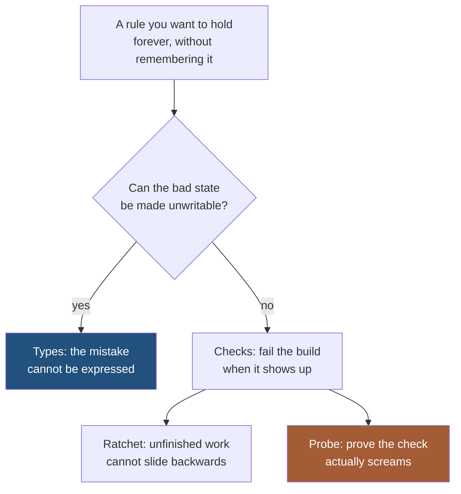

I move fast and in a lot of directions at once. A dozen projects live at any given moment, and I am
almost never coming back to a file I wrote three months ago. So I do not rely on remembering things.
I rely on the build saying no.

That works right up to the moment a check tells you the truth about itself instead of about your code.

Here is the one that got me. A booking product I work on serves five languages. Every word a user
reads has to come from a dictionary, in their language, no exceptions, because the people on the far
side of it are external resellers nobody is supervising. An English label there is not a rough edge.
It is a reseller who cannot finish a sale.

So I did the responsible thing. I wrote a static check that fails the build on any hard-coded
user-visible string, wired it into CI, and scoped it to the screens that were finished. Builds went
green. I moved on to the next project.

Then someone switched the language and read English.

## The check was not wrong. It was narrow.

The check looked at text sitting between tags. That is the obvious place text lives, and it is where
most of it does live. What it could not see was text passed as a value into a component, or text
assembled from a template rather than written as a plain string. Those are not exotic. They are how
half a modern component tree is written.

One tooltip in that product read "Theme: system" in all five languages for weeks. Its file scanned
perfectly clean every single time, because the sentence was assembled rather than written, and my
check only knew how to see written.

That is the part worth sitting with. The check was not buggy. It answered the question it was asked,
correctly, every time. The question was just smaller than I thought it was.

## The move that actually helped

I stopped trusting the report and tested the reporter.

I wrote a small file containing three deliberately untranslated strings, one in each shape I could
think of, and ran the check against it. It found one.

One out of three. On a check I had already shipped, already wired into CI, already told myself
guaranteed something.

That five-minute exercise was worth more than every green build it had produced. And it applies far
past my situation, so here it is, straight:

**A clean report is evidence about your scanner. It is not evidence about your code.**

Every check you write has a blind spot shaped exactly like the thing it cannot parse. Coverage tools
have it. Linters have it. Security scanners have it worst of all. The blind spot is invisible by
construction, because the only thing that would reveal it is precisely the thing the tool cannot see.
So the tool reports zero, and zero looks identical to safe.

The fix is not a better tool. The fix is a habit: **when you write a check, write something it should
catch, and confirm it screams.** Then write the version you are least sure about, and check that one
too. If you have never watched your guard fail, you do not have a guard. You have a green light.

When I widened that check to see the shapes it had been missing, the honest number of outstanding
problems went up, not down. That felt like a regression and was the opposite of one. The number had
always been that high. I had just been reading a smaller instrument.

## Then the same lesson arrived from three more directions

Once you start questioning the shape of your checks rather than their output, you notice the pattern
is not one bug. It is a category.

A check scoped to a folder says nothing about what that folder imports. I had a screen that was
fully translated, fully guarded, passing everything, and it rendered an English word into the middle
of a confirmation message in every language. The word came from a shared building block one directory
over, outside the guarded zone. The guard was telling the truth about its folder. The folder was not
where the problem lived.

A check that parses one file type cannot ever see the others. Some of the text in that product lived
in a plain data structure rather than in a component: the column headings on a printed manifest. No
improvement to a component scanner will ever reach them, no matter how good it gets. Not "did not
reach". Cannot.

And a check that runs in one environment cannot speak for another. Messages the product sends
outward, by email, have no component and no reader present at all. Whatever a component scanner
concludes about them is a coincidence.

Four blind spots, one shape. In each case I had a green signal that was locally honest and globally
meaningless.

## When you cannot detect it, change the shape until it cannot be written

At some point adding a fifth check stops being engineering and starts being superstition. The better
move, when you find a class of bug your tools structurally cannot see, is to make that class
unrepresentable.

Take those printed column headings. The fix was not a smarter scanner. It was removing the place the
English could sit. A column definition no longer holds a heading at all. It holds a pointer into the
dictionary, and the only way to turn a column into something printable is to hand the whole set a
language first.

Three things become true at once, and none of them relies on anyone remembering anything. There is
nowhere to type an English heading, because no such field exists. A column that is missing from the
dictionary will not compile. And because a heading can only be produced for a specific reader, every
place that builds one of these documents is now forced to answer the question it had been skipping:
in whose language?

That last one is my favourite consequence, and it is the one people underrate. The type did not just
block a mistake. It surfaced a question the design had been avoiding.

There is a weaker version of this fix that looks identical and is not. You could let a column hold a
function that returns a heading rather than the heading itself. Feels rigorous. Still lets someone
write a function that returns "Time" and hands you the same bug in a fancier wrapper. Precision here
is the whole game: the shape has to make the bad state impossible, not inconvenient.

The same trick worked on the shared building blocks. Instead of letting them carry a default English
label, I made the label required. The compiler then handed me the complete list of every place that
needed one. Not a sample. The list. And walking that list turned up two more instances of exactly the
bug I had been hunting, in places no folder-scoped check would ever have looked.

That is the difference in one line. **A guard finds instances. A type eliminates the category.**

## The layers, and why there are several

Types first, because they eliminate categories. Checks for what types cannot express. A ratchet
underneath, because a check only protects the surfaces you have already finished, and the unfinished
ones need to be prevented from sliding backwards while they wait their turn. And a probe against
every check, because otherwise you are back to trusting a report.

The ratchet deserves its own sentence. Recording per-file counts and refusing to let any of them rise
sounds bureaucratic and turned out to be the piece that made the whole cleanup safe. It is the only
layer that does something useful about the mess you have not gotten to yet.

## The one that stung

There is a last twist, and it is the most human failure in the whole story, so it is the one most
likely to be yours too.

The automated tests were selecting things on screen by reading their labels. Perfectly reasonable
while a label was a fixed English word. Then the label became translatable, which was the entire
point of the work, and every one of those tests broke at once.

That is not a testing bug. It is a category error. A label is copy that exists for a human, and it is
supposed to change: that is its job, in five languages, whenever someone decides a better word. The
moment a test depends on its exact text, the label is doing two jobs with opposite requirements, and
the one that wanted to change loses.

Anything a human is meant to read is a moving target by design. Tests need to hold onto something
that is not.

## What I actually took away

I did not come out of this with a better opinion about translation. I came out of it with a sharper
question, and it is the one I now ask when someone tells me a check guarantees something:

**What shape of mistake is this check unable to see, and what would it look like if that mistake were
happening right now?**

If the answer is "it would look exactly like this", you do not have a guarantee. You have a green
build and a hypothesis.

I would rather find out which one I have on a Tuesday afternoon with a three-line probe file than
find out from someone who switched the language and could not finish their booking.
